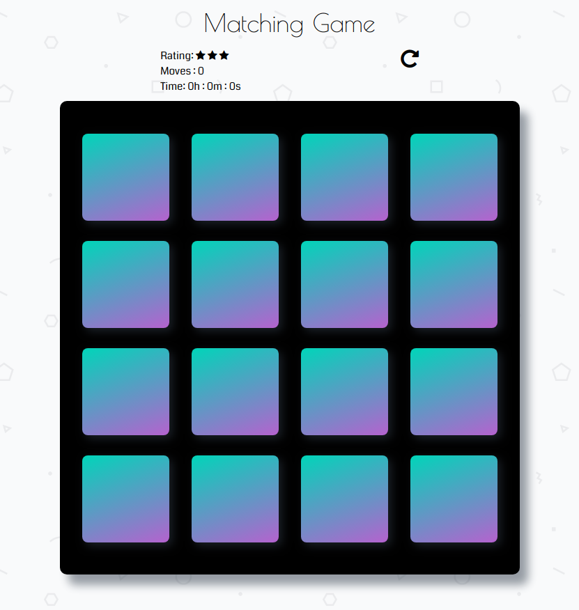
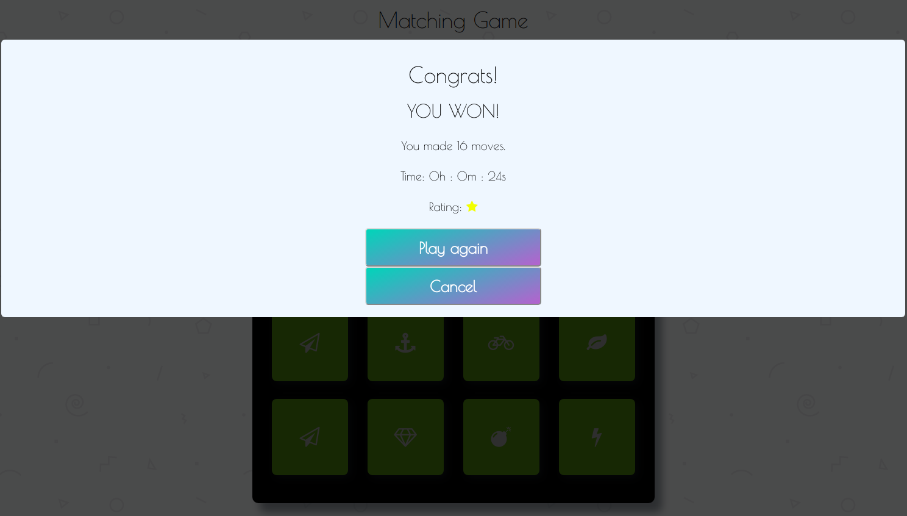

# Memory Game Project

* [General](#general)
* [Goal](#goal)
* [How to play](#how-to-play)
* [Improvements to the original code](#improvements-to-the-original-code)
* [Final outcome](#final-outcome)
* [Running the game](#running-the-game)

## General

Memory game is a simple game created to test your memory.

## Goal
 
The main goal of the game is to find match pictures among ceratain number of different pictures in shortest time possible and in as few moves as possible. 
On every failed atempt to match pictures, they are fliped face down again, only when pictures are matched they stay open, face up.

## How to play

Click on cards until you find matching pictures. If you found a match, card will turn green and be disabled for clicking. If a match is not found, cards turn red and after 1 second flip back face down and can bi used again.
Moves are counted on every pair of cards you open. Star rating lowers as number of moves get bigger. The game finishes when all of the card from deck are matched and turned green. After the game is over, you can play again by clicking Play again button or stop playing by clicking Cancel button.

##Improvements to the original code

For this project I used starter code provided by Udacity. I added improvements to make the game interactive.

Added functionialities:
 * shuffling of cards on every new game
 * matching logic
 * time, move and star tracking
 * congratulations window
 
I also made a few changes regarding game design and added media query to make game look good on every device.
 
 ##Final outcome 
 
 
 
##Running the game
 * Use the <strong>index.html</strong> file to run the game in your browser.
 
